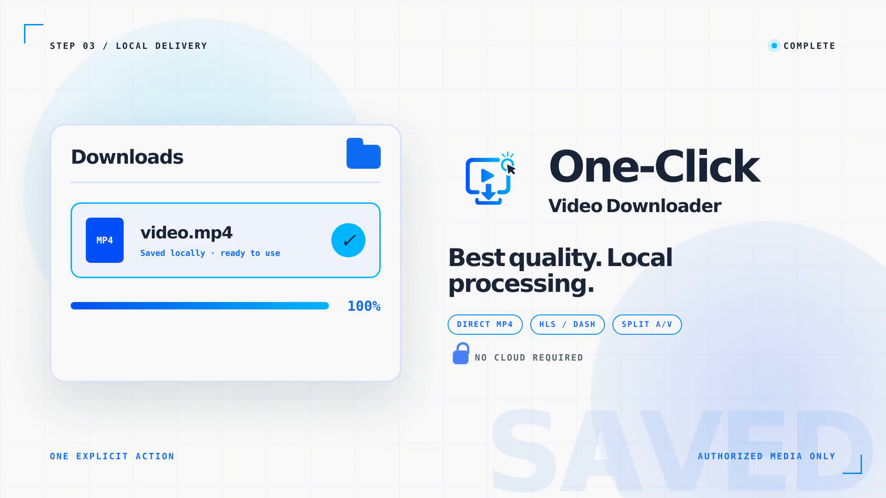
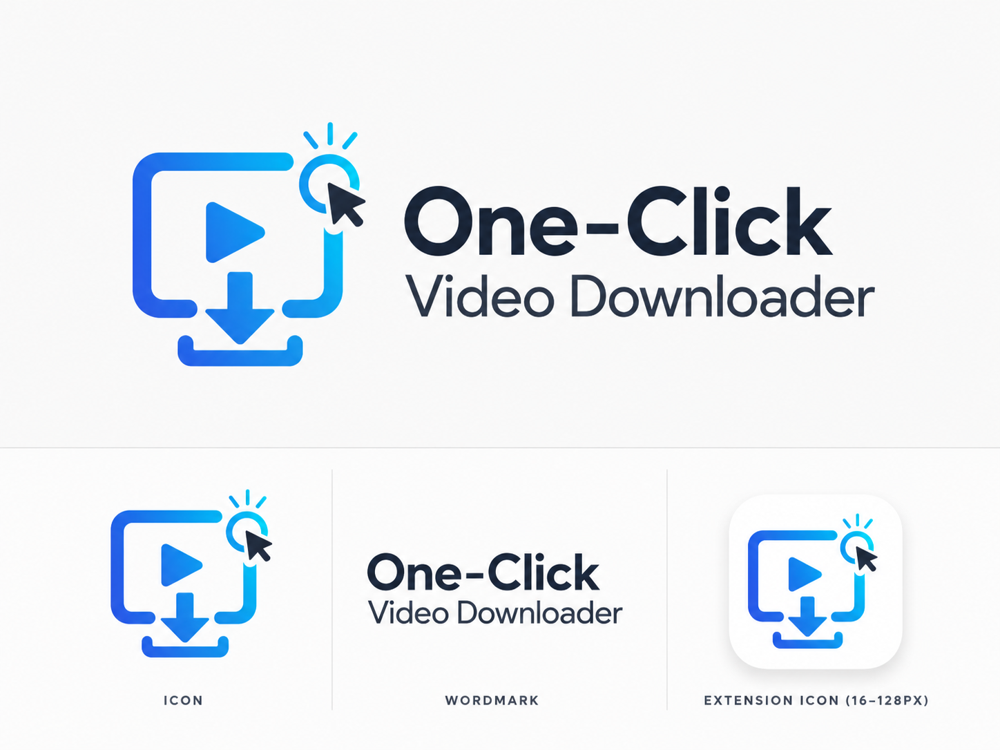

# One-Click Video Downloader

<p align="center">
  <a href="assets/showcase/one-click-video-downloader-showcase.mp4">
    
  </a>
</p>

<p align="center">
  <a href="assets/showcase/one-click-video-downloader-showcase.mp4">Watch the 12-second project showcase (MP4)</a>
</p>

A personal Manifest V3 extension that detects authorized page video, selects the best available candidate, and saves a local MP4 through one primary action.

It is intentionally smaller than Cat Catch: the resource list, manual parser controls, cloud features, and engine settings are replaced by one automatic plan.

Release `0.2.0` adds controlled live recording, resilient native jobs, codec-aware output, an optional page extractor, opt-in in-memory HLS detection, and sleep prevention. Implementation status and remaining desktop verification are tracked in [BACKLOG.md](BACKLOG.md). Contributor setup and project boundaries are in [CONTRIBUTING.md](CONTRIBUTING.md).

## Brand identity



The identity combines the page-video frame, play symbol, download action, and cursor click into one mark. The source composition for the showcase is kept in [`hyperframes/readme-showcase`](hyperframes/readme-showcase/) so the motion asset can be reproduced and revised with the project.

## What works

- Direct MP4 detection and browser-managed download.
- HLS (`.m3u8`) and DASH (`.mpd`) detection.
- Automatic pairing of separately detected video and audio.
- Live-stream recording with **Stop and save**, finite-download cancellation, and playable-output validation.
- Bounded network reconnects and whole-job retries for temporary failures.
- Codec-aware output that copies compatible streams and transcodes only incompatible video or audio.
- Local progress and completion messages through Chrome Native Messaging.
- Authenticated requests using an allowlisted copy of Cookie, Authorization, Origin, Referer, and User-Agent headers.
- Unique, sanitized filenames in the host operating system's Downloads directory.
- Optional pinned yt-dlp page fallback when normal request detection finds nothing.
- Optional per-site HLS Blob detection for manifests created entirely in page memory.
- Optional system wake lock while native processing is active.
- Automatic kebab-case filenames from the page title (e.g. `showcase-video.mp4`), with an optional page-heading naming mode.
- Up to three downloads at once, each with its own live progress; downloads keep running in the background if the popup closes.

DRM bypass, credential automation, batch download, and site-specific extractors are explicitly outside this project.

## How it works

```text
page requests ──► normal detector ──► best candidate plan
                         │                ├─ direct MP4 ──► chrome.downloads
                         │                └─ HLS / DASH / split tracks
                         │                                  │
                         ├─ no candidate ──► optional yt-dlp page fallback
                         └─ opt-in site ───► bounded in-memory HLS detector
                                                            │
                                                            ▼
                                                   Native Messaging host
                                                            │
                                                            ▼
                                                   local FFmpeg ──► Downloads/*.mp4
```

Media files and segments never pass through Native Messaging. The extension sends URLs and selected request headers; the host lets FFmpeg retrieve and process media directly. The opt-in deep detector may send bounded HLS manifest text, but never the video segments themselves.

## Requirements

- Chrome or Edge 102+.
- Python 3.10+ on the same operating system that runs the browser.
- FFmpeg and ffprobe on that operating system's `PATH`.
- Node.js 20+ only for development tests.

Both test and production Python run from a `.venv` directory. The normal host uses only the Python standard library. yt-dlp is an optional, pinned production dependency installed into the production `.venv` only when requested.

## Windows + Chrome: complete setup

Use this section when both the cloned repository and Google Chrome run directly on Windows. It does not apply when the repository is inside WSL; that case is covered under [Install the production native host](#install-the-production-native-host).

### 1. Check the Windows prerequisites

Install [Python 3.10 or newer](https://www.python.org/downloads/windows/) and a Windows build of [FFmpeg](https://ffmpeg.org/download.html#build-windows). FFmpeg's `bin` directory must be included in the Windows `PATH`.

Open a new PowerShell window and verify all three commands:

```powershell
py -3 --version
ffmpeg -version
ffprobe -version
```

If FFmpeg was just added to `PATH`, completely close Chrome before continuing. Chrome passes its environment to the native host, so an already-running browser may retain the old `PATH`.

### 2. Create the project test `.venv`

From the cloned repository:

```powershell
cd knowledge\projects\one-click-video-downloader
py -3 -m venv .venv
.\.venv\Scripts\python.exe -m pip install -r requirements.txt
```

The requirements file is intentionally empty except for documentation; creating the `.venv` is still mandatory so test and setup commands never depend on an uncontrolled global interpreter.

Optional verification for contributors with Node.js 20+:

```powershell
npm test
```

### 3. Load the extension into Chrome

1. Open `chrome://extensions`.
2. Enable **Developer mode** in the upper-right corner.
3. Select **Load unpacked**.
4. Choose `knowledge\projects\one-click-video-downloader\extension` inside the clone.
5. Find **One-Click Video Downloader** and copy its 32-character extension ID.

Chrome's official unpacked-extension workflow is documented [here](https://developer.chrome.com/docs/extensions/get-started/tutorial/hello-world#load-unpacked).

### 4. Install the production native host

Run the installer with the project `.venv`, replacing the placeholder with the ID copied from Chrome:

```powershell
.\.venv\Scripts\python.exe native-host\install_host.py `
  --extension-id YOUR_EXTENSION_ID `
  --browser chrome `
  --with-yt-dlp
```

Omit `--with-yt-dlp` if you want only the normal MP4/HLS/DASH/split-track detector. The extension remains fully usable without the page fallback.

The installer performs five local actions:

- Copies the native host to `%LOCALAPPDATA%\OneClickVideoDownloader`.
- Creates `%LOCALAPPDATA%\OneClickVideoDownloader\.venv` for production.
- Optionally installs the pinned yt-dlp release into that production `.venv`.
- Generates a launcher bound to that production interpreter.
- Registers the host under the current user's Chrome Native Messaging registry key, restricted to the copied extension ID.

The repository `.venv` is for setup and testing. The `%LOCALAPPDATA%` `.venv` is the production environment Chrome launches.

### 5. Restart and verify Chrome

1. Close every Chrome window and confirm Chrome is no longer running in Task Manager.
2. Start Chrome again and return to `chrome://extensions`.
3. Press the extension's **Reload** button.
4. Pin and open the extension.

The popup footer should show FFmpeg and ffprobe versions. If it still says the native host is unavailable, use the troubleshooting section below.

### 6. Download a video

1. Open a page containing a video you are authorized to save.
2. Start playback so the page requests its media resources.
3. Open **One-Click Video Downloader**.
4. Select **Download best quality**.

Direct MP4 files use Chrome's download manager. HLS, DASH, non-MP4, or separate audio/video resources are processed by the local production host and saved under `%USERPROFILE%\Downloads`. Finite native jobs expose **Cancel download**; streams without a finite duration expose **Stop and save**.

If nothing is detected, the popup offers two explicit fallbacks:

- **Page extractor fallback** appears when yt-dlp was installed. Browser cookies remain off unless you select the cookie option and approve Chrome's permission prompt.
- **Enable deep detection for this site** grants the optional scripting capability for that site's origin, reloads the page, and observes only HLS-typed Blob objects up to 2 MiB.

The optional power prompt may appear before a native job. Denying it does not block the download; it only allows Windows to sleep normally.

### Updating or removing the Windows host

After pulling changes that modify `native-host\`, rerun the installation command and restart Chrome. Include `--with-yt-dlp` to install or explicitly upgrade the version pinned in `requirements-yt-dlp.txt`; the host never updates it silently.

To unregister it:

```powershell
.\.venv\Scripts\python.exe native-host\install_host.py --uninstall --browser chrome
```

### Windows troubleshooting

- **“Specified native messaging host not found”** — confirm the extension ID, rerun step 4, then fully restart Chrome. Reloading only the extension may not be sufficient.
- **“FFmpeg is not available on PATH”** — confirm both `ffmpeg -version` and `ffprobe -version` work in a new PowerShell window, then fully restart Chrome.
- **The extension ID changed** — rerun the installer with the new ID; the host deliberately rejects every extension origin except the registered one.
- **Chrome downloads the video but FFmpeg jobs fail** — keep the source page open and authenticated until processing completes. Signed media URLs and cookies may expire.
- **“Page extractor fallback” does not appear** — rerun the installer with `--with-yt-dlp`, fully restart Chrome, then reopen the popup.
- **A live stream never finishes** — use **Stop and save**. The host first asks FFmpeg to finalize the MP4, then validates it before presenting it as complete.
- **Deep detection finds nothing** — enable it before playback, allow the page reload, then start the video again. It intentionally observes HLS Blob manifests only, not every fetch/XHR call.
- **The repository was moved** — the installed host keeps working because it was copied to `%LOCALAPPDATA%`. Rerun the installer only when its source changes or the extension ID changes.

## Development setup

Linux or WSL:

```bash
cd knowledge/projects/one-click-video-downloader
python3 -m venv .venv
.venv/bin/python -m pip install -r requirements.txt
npm test
```

Windows PowerShell:

```powershell
cd knowledge\projects\one-click-video-downloader
py -3 -m venv .venv
.\.venv\Scripts\python.exe -m pip install -r requirements.txt
npm test
```

## Install the unpacked extension

1. Open `chrome://extensions` or `edge://extensions`.
2. Enable **Developer mode**.
3. Choose **Load unpacked** and select this project's `extension/` folder.
4. Copy the generated 32-character extension ID. The native host registration is restricted to this ID.

## Install the production native host

The installer copies the host into a user-local application directory, creates a dedicated production `.venv`, generates its launcher, and registers the Native Messaging manifest.

If Chrome runs on Linux:

```bash
.venv/bin/python native-host/install_host.py \
  --extension-id YOUR_EXTENSION_ID \
  --browser chrome \
  --with-yt-dlp
```

Use `--browser edge`, `chromium`, or `brave` when appropriate.

If Chrome runs on Windows while this repository is inside WSL, run the installer with **Windows Python**, not WSL Python:

```bash
py.exe -3 "$(wslpath -w native-host/install_host.py)" \
  --extension-id YOUR_EXTENSION_ID \
  --browser chrome \
  --with-yt-dlp
```

This creates `%LOCALAPPDATA%\OneClickVideoDownloader\.venv` and registers the host in the current Windows user's browser registry. Windows FFmpeg must also be on the Windows `PATH`; the FFmpeg installed inside WSL is not visible to Windows Chrome.

`--with-yt-dlp` is optional. It installs the exact version in `requirements-yt-dlp.txt` into the production `.venv`; omit it if normal network detection covers your sites. After installation, reload the extension from the browser's extensions page. Opening the popup should show both FFmpeg and ffprobe versions instead of a host error.

To unregister the host:

```bash
.venv/bin/python native-host/install_host.py --uninstall --browser chrome
```

Run the uninstall command with Windows Python when unregistering Windows Chrome.

## Use

1. Open a page containing a video you are authorized to save.
2. Start playback so the page requests its media.
3. Open the extension popup.
4. Press **Download best quality**.
5. Keep the source tab open while authenticated media is processed.

Direct MP4 files use the browser downloader. Adaptive, split, and page-fallback jobs continue through the native host if the popup closes; reopening it restores the current job state. Use **Cancel download** for finite work or **Stop and save** for a live recording.

Files are named after the page title as a kebab-case slug (for example `showcase-video.mp4`). Enable **Use page headings for filenames** in the popup to name files from the page's on-screen `<h1>` instead; this asks for the optional `scripting` permission and falls back to the title on pages where it cannot read the heading.

You can run several downloads at once (up to three). Start one, switch to another tab or video, and start another; each shows its own live progress in the popup, and downloads keep running in the background if you close it.

Finished downloads stay listed so you can confirm them. Dismiss a single card with its **×**, or use **Clear finished** to remove them all at once. Clearing only tidies the popup list — it never deletes the saved files.

## Verification

`npm test` runs:

- Candidate classification and highest-quality plan selection tests.
- Manifest reference and permission checks.
- Native protocol, URL, header, command-construction, and installer tests.
- Job cancellation, Windows/POSIX termination, retry classification, cookie-file cleanup, HLS resolution, optional permission, and wake-lock tests.
- Real FFmpeg integration tests that merge tracks and gracefully stop a live-style process while preserving video and audio.

Final browser verification must happen on the desktop browser because this WSL environment has no GUI Chromium installation.

An optional localhost smoke test exercises a temporary HTTP failure, separate-track merge, inline HLS with relative segments, and independent video/audio transcoding. Run it where binding a local test port is allowed:

```bash
.venv/bin/python tests/http_smoke.py
```

## Security and provenance

- Only HTTP(S) media inputs are accepted by the host.
- Captured header values containing newlines are rejected.
- FFmpeg is invoked with an argument array, never through a shell.
- yt-dlp is invoked through the production `.venv`, ignores user configuration, disables plugin directories, and never self-updates.
- Cookie handoff is disabled by default and uses a private temporary Netscape-format file when explicitly enabled.
- In-memory manifests are limited to 2 MiB and may resolve only HTTP(S) remote references.
- Deep-detected manifests inherit only Origin, Referer, and User-Agent; arbitrary recent Cookie or Authorization values are not forwarded to a different manifest host.
- The host manifest allows only the selected extension ID.
- Everything stays local; no analytics or remote service is used.

The detector architecture is informed by the local Cat Catch source at `knowledge/sources/video-downloader-extension/cat-catch`. Cat Catch and this project are GPL-3.0 licensed; preserve source, attribution, modification notices, and other GPL obligations when distributing a build.
